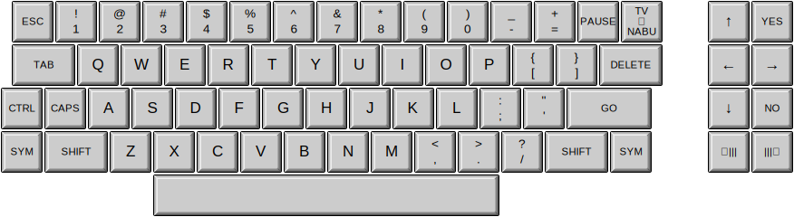

# Keyboards

## Standard Full-Size Keyboards

### ANSI

### ISO

### JIS

## Tenkeyless Keyboards

### ANSI TKL

### ISO TKL

### JIS TKL

## 60% Keyboards

### ANSI 60%

### ISO 60%

### JIS 60%

## Keyboards for Legacy Computing

### Amiga

### Apple Lisa, US

### Commodore 64

### Commodore 128

### Famicom

### NABU

### Space Cadet

