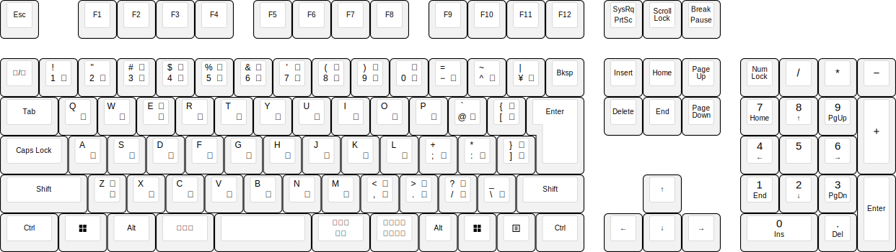
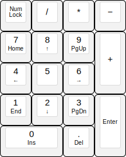
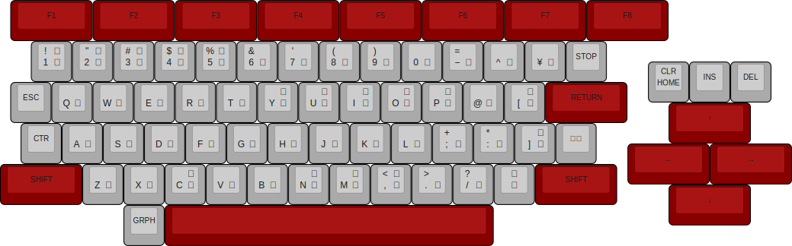
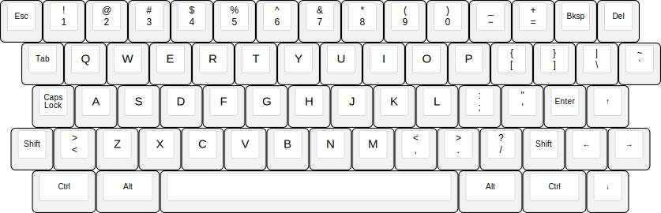
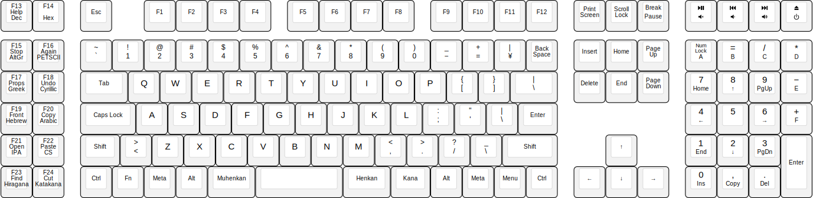
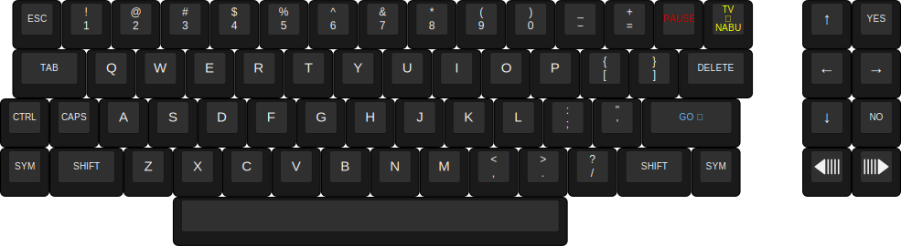

# Keyboard Diagrams

## Standard Full-Size Keyboards

### ANSI

### ISO US

### ISO UK

### ISO FR

### ISO DE

### JIS

## Tenkeyless Keyboards

### ANSI TKL

### ISO US TKL

### ISO UK TKL

### ISO FR TKL

### ISO DE TKL

### JIS TKL

## 60% Keyboards

### ANSI 60%

### ISO US 60%

### ISO UK 60%

### ISO FR 60%

### ISO DE 60%

### JIS 60%

## Keypads

### Keypad

## IBM Keyboards

### IBM Model F XT, US
This is why we can't have ~~nice things~~ sensible scan codes for the 'print screen' and 'pause/break' keys.

### IBM Model F XT, DE

### IBM Model F AT, US

### IBM Model F122

### IBM Model M, US

### IBM Model M, Space Saving, US

## Apple Keyboards

### Apple Lisa, US

### Macintosh 512K Keyboard, ANSI
* KbdType 3
* Gestalt ID 1

### Macintosh 512K Keyboard, ISO
* KbdType 3
* Gestalt ID 1

### Macintosh 512K Keypad, ANSI
* KbdType 3
* Gestalt ID 2

### Macintosh 512K Keypad, ISO
* KbdType 3
* Gestalt ID 2

### Macintosh Plus Keyboard, ANSI
* KbdType 11
* Gestalt ID 3

### Macintosh Plus Keyboard, ISO
* KbdType 11
* Gestalt ID 3

### Apple Standard Keyboard, ANSI
* KbdType 1
* Gestalt ID 5

### Apple Standard Keyboard, ISO
* KbdType 4
* Gestalt ID 8

### Apple Extended Keyboard, ANSI
* KbdType 2
* Gestalt ID 4

### Apple Extended Keyboard, ISO
* KbdType 5
* Gestalt ID 9

### Apple Keyboard II, ANSI
* KbdType 8
* Gestalt ID 10

### Apple Keyboard II, ISO US
* KbdType 9
* Gestalt ID 11

### Apple Keyboard II, ISO IT
* KbdType 9
* Gestalt ID 11

### Macintosh PowerBook Keyboard, ANSI
* KbdType 12
* Gestalt ID 12

### Macintosh PowerBook Keyboard, ISO
* KbdType 13
* Gestalt ID 13

### Apple Adjustable Keyboard, ANSI
* KbdType 16
* Gestalt ID 15

### Apple Adjustable Keyboard, ISO US
* KbdType 17
* Gestalt ID 16

### Apple Adjustable Keyboard, ISO DE
* KbdType 17
* Gestalt ID 16

### Apple Adjustable Keyboard, Keypad, ANSI
* KbdType 14
* Gestalt ID 14

### Apple Adjustable Keyboard, Keypad, ISO
* KbdType 14
* Gestalt ID 14

### Apple Newton Keyboard, ANSI US

### Apple Newton Keyboard, ANSI UK

### Apple Newton Keyboard, ISO US

### Apple Newton Keyboard, ISO DE

### PowerBook Extended Keyboard, ANSI
* KbdType 24
* Gestalt ID 24

### PowerBook Extended Keyboard, ISO
* KbdType 20
* Gestalt ID 20

### PowerBook Subnote Keyboard, ANSI
* KbdType 28
* Gestalt ID 28

### PowerBook Subnote Keyboard, ISO
* KbdType 29
* Gestalt ID 29

### PowerBook Subnote Keyboard, JIS
* KbdType 30
* Gestalt ID 30

### PowerBook G3 Keyboard, ANSI
* KbdType 195
* Gestalt ID 195

### PowerBook G3 Keyboard, ISO
* KbdType 196
* Gestalt ID 196

### PowerBook G3 Keyboard, JIS
* KbdType 197
* Gestalt ID 197

### PowerBook 1999 Keyboard, JIS
* KbdType 201
* Gestalt ID 201

## Sun Keyboards

### Sun Type 5, UNIX

### Sun Type 5, ANSI

### Sun Type 5, ISO

### Sun Type 6, UNIX

### Sun Type 6, ANSI

### Sun Type 6, ISO

### Sun Type 7, UNIX

### Sun Type 7, ANSI

### Sun Type 7, ISO

## Commodore Keyboards

### Commodore PET Chiclet Keyboard

### Commodore PET Graphics Keyboard

### Commodore PET Business Keyboard

### Commodore VIC 20

### Commodore 64

### Commodore MAX Machine

### Commodore 16

### Commodore Plus/4

### Commodore 128

### Commodore 64C

### Commodore Amiga 500, US

## Inkbox ASK Profiles

### Leftside - ANSI

### Leftside - ISO US

### Leftside - ISO UK

### Leftside - ISO FR

### Leftside - ISO DE

### Leftside - JIS

### Leftside - Triplex

### Rightside - Keypad

### Rightside - Macro Pad

### Rightside - Large Macros

## Other Keyboards

### Famicom

### [K65](https://github.com/kreativekorp/segterm/tree/master/board/K65)

### [K130](https://github.com/RebeccaRGB/K130)

### NABU

### Osborne Vixen

### Space Cadet

### [TTCC (Two-Thirds California Case)](https://github.com/RebeccaRGB/ttcc)

### [Two-Thirds Keyboard (Original by Attoparsec)](https://www.attoparsec.com/artifacts/twothirds.html)

