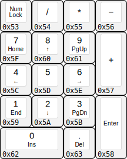

# Keyboard Diagrams with USB HID Codes

Jump to:
- [Standard Full-Size Keyboards](#standard-full-size-keyboards)
- [Tenkeyless Keyboards](#tenkeyless-keyboards)
- [60% Keyboards](#60-keyboards)
- [Keypads](#keypads)
- [Sun Keyboards](#sun-keyboards)
- [Inkbox ASK Profiles](#inkbox-ask-profiles)
- [Kreative Custom Keyboards](#kreative-custom-keyboards)

## Standard Full-Size Keyboards

### ANSI

### ISO US

### ISO UK

### ISO FR

### ISO DE

### JIS

[Back to Top](#keyboard-diagrams-with-usb-hid-codes)

## Tenkeyless Keyboards

### ANSI TKL

### ISO US TKL

### ISO UK TKL

### ISO FR TKL

### ISO DE TKL

### JIS TKL

[Back to Top](#keyboard-diagrams-with-usb-hid-codes)

## 60% Keyboards

### ANSI 60%

### ISO US 60%

### ISO UK 60%

### ISO FR 60%

### ISO DE 60%

### JIS 60%

[Back to Top](#keyboard-diagrams-with-usb-hid-codes)

## Keypads

### Keypad

[Back to Top](#keyboard-diagrams-with-usb-hid-codes)

## Sun Keyboards

### Sun Type 5, UNIX

### Sun Type 5, ANSI

### Sun Type 5, ISO

### Sun Type 6, UNIX

### Sun Type 6, ANSI

### Sun Type 6, ISO

### Sun Type 7, UNIX

### Sun Type 7, ANSI

### Sun Type 7, ISO

[Back to Top](#keyboard-diagrams-with-usb-hid-codes)

## Inkbox ASK Profiles

### Leftside - ANSI

### Leftside - ISO US

### Leftside - ISO UK

### Leftside - ISO FR

### Leftside - ISO DE

### Leftside - JIS

### Leftside - Triplex

### Rightside - Keypad

[Back to Top](#keyboard-diagrams-with-usb-hid-codes)

## Kreative Custom Keyboards

### [K65 8×8 Matrix Keyboard](https://github.com/kreativekorp/segterm/tree/master/board/K65)

### [K130 Battlestation Keyboard](https://github.com/RebeccaRGB/K130)

### K130 US AltGr Layout

### K130 PETSCII Layout

### K130 Greek Symbol Layout

### K130 Cyrillic Layout

### K130 Hebrew Layout

### K130 Arabic Layout

### K130 IPA Layout

### K130 Sitelen Pona Layout

### K130 JIS Hiragana Layout

### K130 JIS Katakana Layout

[Back to Top](#keyboard-diagrams-with-usb-hid-codes)
