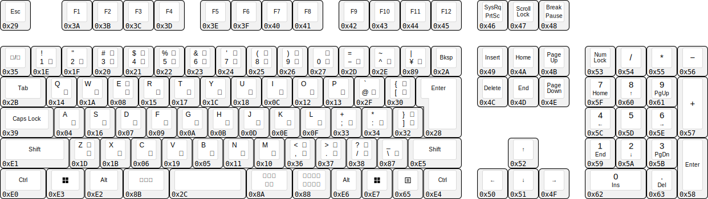
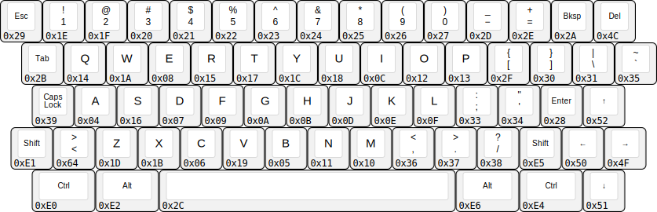
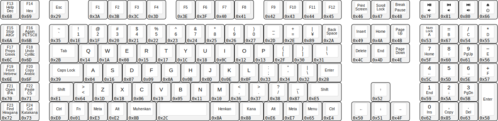

# Keyboard Diagrams with USB HID Codes

## Standard Full-Size Keyboards

### ANSI

### ISO US

### ISO UK

### ISO FR

### ISO DE

### JIS

## Inkbox ASK Profiles

### ANSI

### ISO US

### ISO UK

### ISO FR

### ISO DE

### JIS

### Triplex

### Keypad

## Other Keyboards

### [K65](https://github.com/kreativekorp/segterm/tree/master/board/K65)

### [K130](https://github.com/RebeccaRGB/K130)

