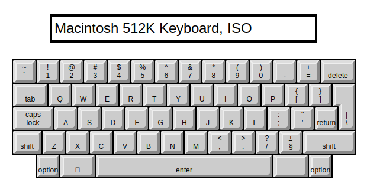
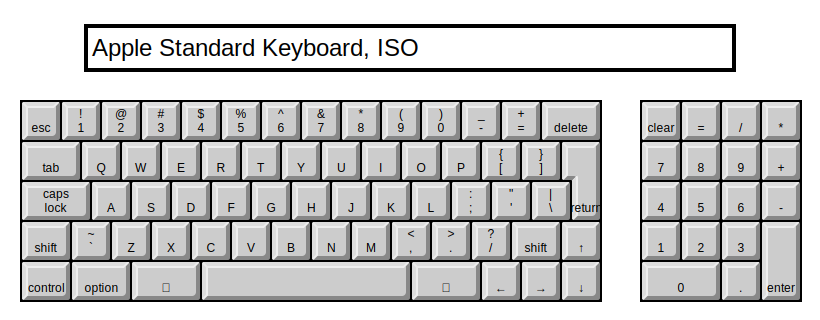
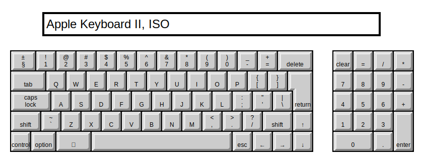
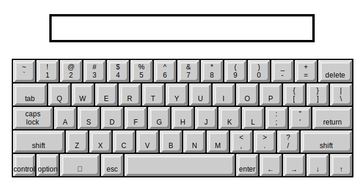

These SVGs have been generated from the KCAP resources used by the Key Caps desk accessory.

### Macintosh 512K Keyboard, ANSI
* KbdType 3
* Gestalt ID 1

### Macintosh 512K Keyboard, ISO
* KbdType 3
* Gestalt ID 1

### Macintosh Plus Keyboard
* KbdType 11
* Gestalt ID 3

### Apple Standard Keyboard, ANSI
* KbdType 1
* Gestalt ID 5

### Apple Standard Keyboard, ISO
* KbdType 4
* Gestalt ID 8

### Apple Extended Keyboard, ANSI
* KbdType 2
* Gestalt ID 4

### Apple Extended Keyboard, ISO
* KbdType 5
* Gestalt ID 9

### Apple Keyboard II, ANSI
* KbdType 8
* Gestalt ID 10

### Apple Keyboard II, ISO
* KbdType 9
* Gestalt ID 11

### Unknown Keyboard
* KbdType 10
* Gestalt ID Unknown
* Identical to KbdType 12 (Macintosh PowerBook Keyboard, ANSI)

### Macintosh PowerBook Keyboard, ANSI
* KbdType 12
* Gestalt ID 12

### Macintosh PowerBook Keyboard, ISO
* KbdType 13
* Gestalt ID 13

### Apple Adjustable Keyboard, ANSI
* KbdType 16
* Gestalt ID 15

### Apple Adjustable Keyboard, ISO
* KbdType 17
* Gestalt ID 16

### Apple Adjustable Keyboard, Keypad
* KbdType 14
* Gestalt ID 14

### PowerBook Extended Keyboard, ANSI
* KbdType 24
* Gestalt ID 24

### PowerBook Extended Keyboard, ISO
* KbdType 20
* Gestalt ID 20

### PS/2 Keyboard
* KbdType 27
* Gestalt ID 27
* Identical to KbdType 2 (Apple Extended Keyboard, ANSI)

### PowerBook Subnote Keyboard, ANSI
* KbdType 28
* Gestalt ID 28

### PowerBook Subnote Keyboard, ISO
* KbdType 29
* Gestalt ID 29

### PowerBook Subnote Keyboard, JIS
* KbdType 30
* Gestalt ID 30

### PowerBook G3 Keyboard, ANSI
* KbdType 195
* Gestalt ID 195

### PowerBook G3 Keyboard, ISO
* KbdType 196
* Gestalt ID 196

### PowerBook G3 Keyboard, JIS
* KbdType 197
* Gestalt ID 197

### PowerBook 1999 Keyboard, JIS
* KbdType 201
* Gestalt ID 201

